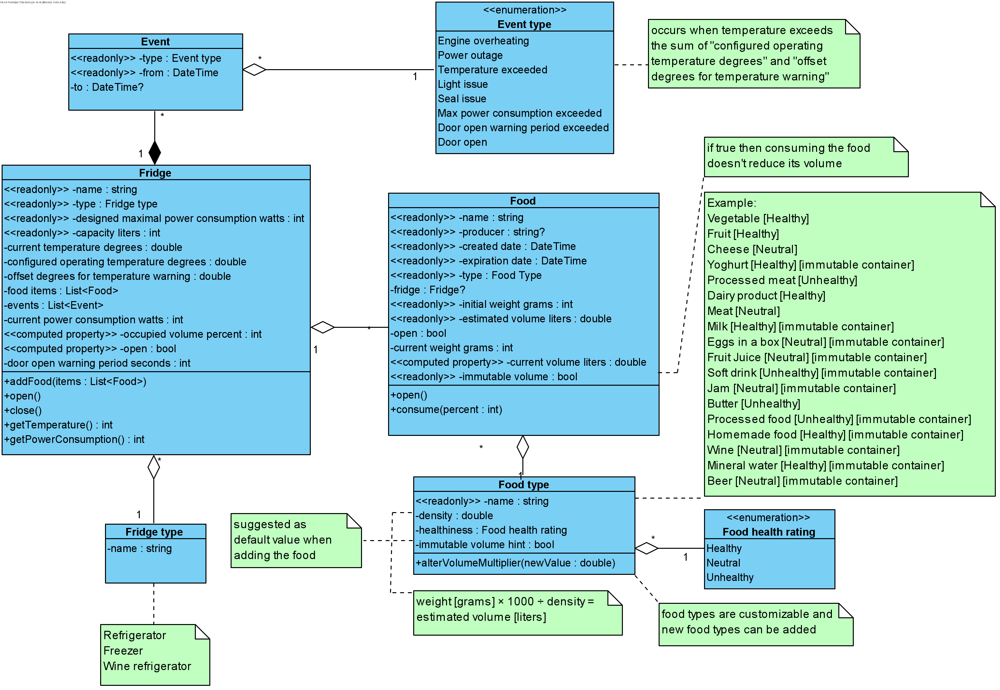
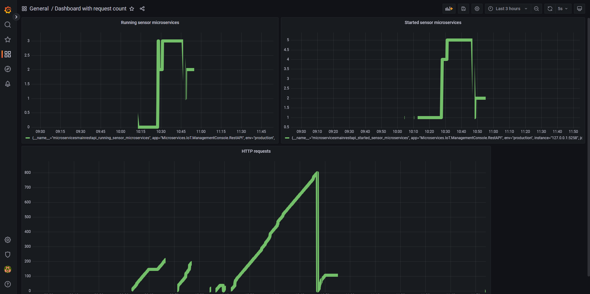
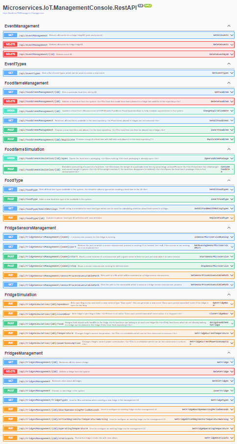

The main project scenario
- the main scenario was to connect sensor types from individual team members into a main management console
  - the UI is implemented but only for fridge sensors because of project time limitations
  - the other team members' sensor type microservices are not connected

System
- the system theme is fridge sensors
  - the sensors are only simulated and the data is synchronized through database
  - each sensor can run on its own process which has REST access
  - running sensor instances are controlled by the main management REST service (server)

Implemented scenarios:
- metrics using Prometheus
- visualisation using Grafana
- polyglot microservices (.NET)
- Swagger UI (full scenario with as most documentation as possible)
  - I also implemented Swagger UI authorization middleware using HTTP Basic auth
- full database support - ORM using MS SQL Server
- self-healing capabilities
  - sort of - the main server can start and stop individual sensor microservices on demand

Components
1) REST API - data management console 
- technology: ASP.NET Core
- full management API to set up:
  - fridges/freezers (individual devices)
  - events and event types (representing warnings from sensors)
  - food, food types and food health rating
  - all stored in local database
- sensors management API
  - allows to watch, run, stop microservice sensors
  - acts as a name service - each fridge can have its microservice running
- full Swagger UI for all methods available in the system
- layered architecture

- swagger JSON available in folder Swagger JSONs

2) REST API - sensor microservice
- technology: ASP.NET Core
- process which is registered for an existing fridge of given name
- simulates a sensor which is active on a fridge
- sensor has API to report data received from fridge
  - in fact from database
- full Swagger UI for all methods available

- swagger JSON available in folder Swagger JSONs

3) desktop application - dashboard
- .NET Framework

4) metrics dashboard
- technology: Prometheus and Grafana
- contains metrics from the main management console server
  - total HTTP requests count
  - total started microservices count
  - curretly running microservices count

Story/scenario of usage:
- if the sensors were running on real devices, the system could provide a nice overview of all devices that the user has in management (a dashboard)

Why microservice architecture can be appropriate:
- for IoT, using microservices is a natural approach because then every sensor can run individually without the need for a centralized entity (which would be needed to send data to and get data from by the users)

Benefits of using microservices in this project
- the project can scale for unlimited amount of fridges

Drawbacks of microservices in this project
- the microservice instances are dynamically created
  - this is a problem for monitoring using Prometheus and Grafana

Message-drivencess
- the system API uses asynchronous .NET API

Elasticity
- the main server cannot be scaled but the microservices for each sensor are created on demand

Data model:

Grafana metrics:

Management system REST API Swagger UI:

